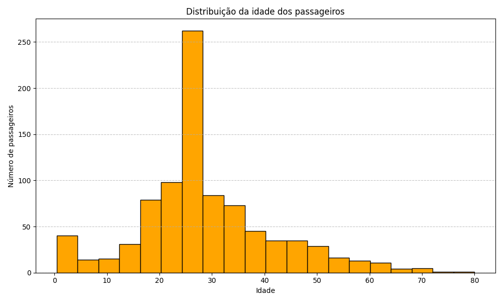
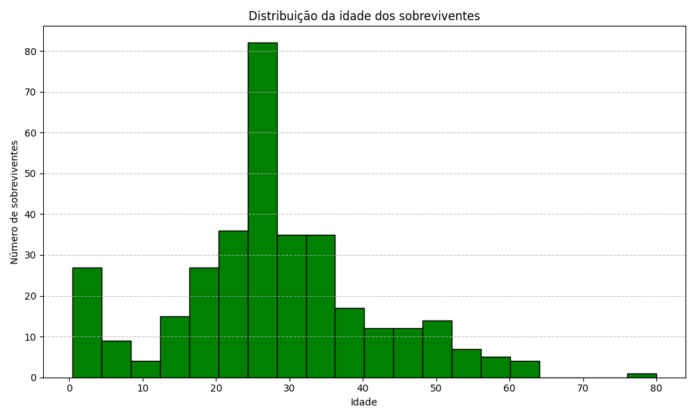
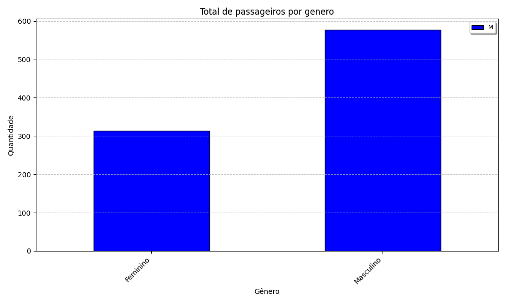
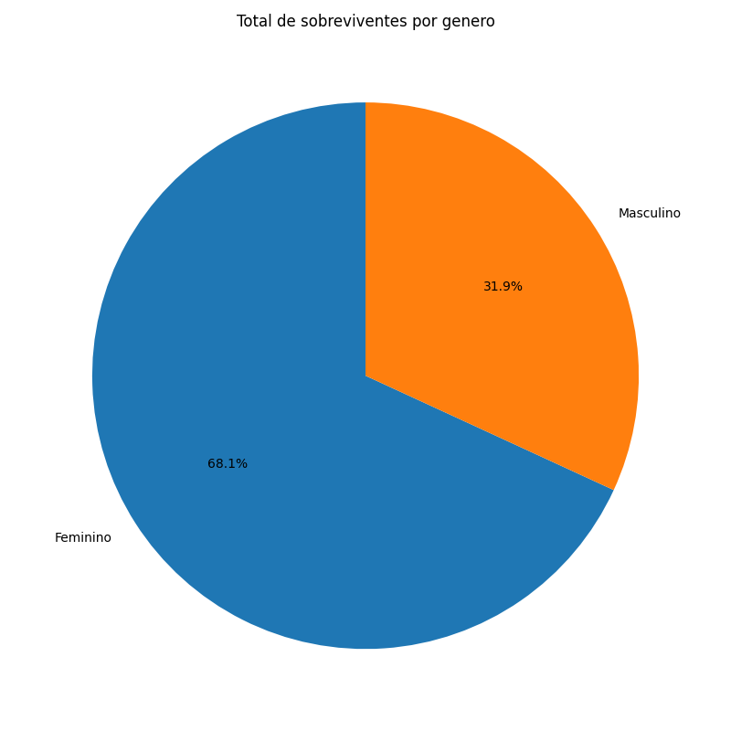
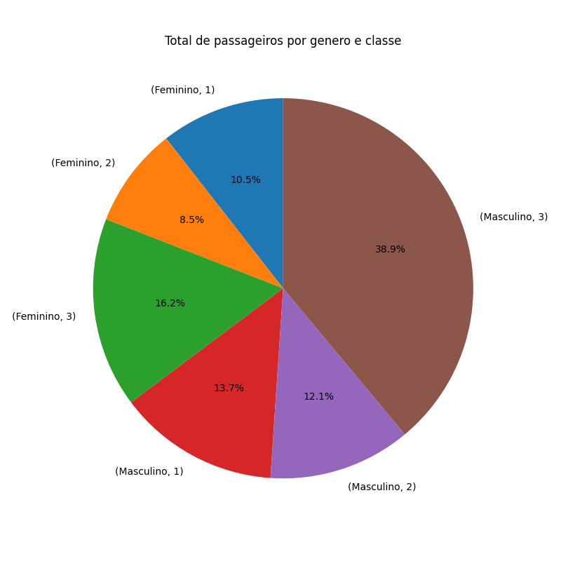
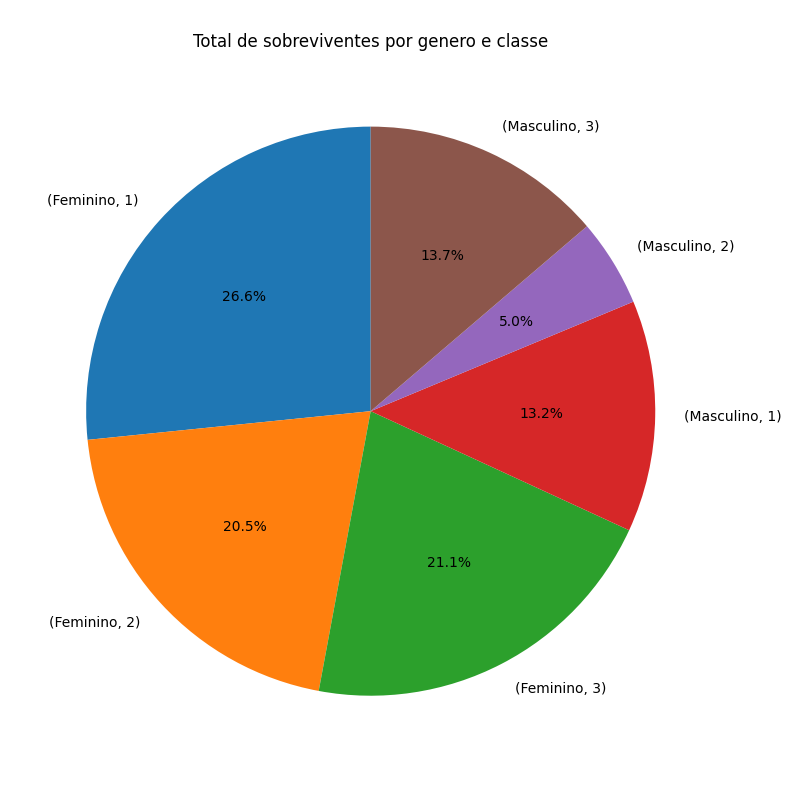

# Desafio Extra: Introdução ao Data Science

SCtech.

## Objetivo do Projeto

O estudante deverá utilizar a base de dados pública do Titanic, em formato CSV, com o objetivo de realizar uma Análise Exploratória de Dados (AED). A atividade consiste em importar, organizar e analisar o conjunto de dados, buscando compreender o comportamento geral das informações e identificar padrões, relações entre variáveis e possíveis fatores associados à sobrevivência dos passageiros. A partir desse processo, espera-se a obtenção de insights relevantes, como estatísticas descritivas, distribuições, comparações entre grupos e análises exploratórias das variáveis disponíveis.

## Dicionário de Dados

| Coluna       | Descrição                                      | Tipo                |
|--------------|------------------------------------------------|---------------------|
| PassengerId  | Identificação do passageiro                    | Numérico            |
| Survived     | 1 - sobreviveu, 0 - não sobreviveu             | Numérico (0/1)      |
| Pclass       | 1 - primeira (convés superior), 2 - segunda (meio), 3 - terceira (convés inferior) | Numérico |
| Name         | Nome dos passageiros                           | Texto               |
| Sex          | Gênero                                         | Texto (male/female) |
| Age          | Idade                                          | Numérico            |
| SibSp        | Irmãos/cônjuges                                | Numérico            |
| Parch        | Pais/filhos                                    | Numérico            |
| Ticket       | Bilhete                                        | Texto               |
| Fare         | Tarifa                                         | Dinheiro            |
| Cabin        | Cabine                                         | Texto               |
| Embarked     | Porto de embarque                              | Texto               |

## Ferramentas Utilizadas

- VSCode
  - Extensões: GitHub Copilot, Markdown Preview, Pylance, Python, Python Debugger, Python Environments
- Python: 3.12.3, uv
  - Bibliotecas: pandas, matplotlib

## Desenvolvimento do Projeto

Estes foram os passos executados para o desenvolvimento do projeto, mas não são necessários para a execução deste.

- Instalação do [uv](https://docs.astral.sh/uv/) para gerenciamento de pacotes, ambientes virtuais e execução do projeto. O uv foi desenvolvido para trazer mais performance às atividades de desenvolvimento em Python.
- Iniciar novo projeto: **uv init sctech-desafio-data-science**.
- Todas as atividades são executadas na pasta sctech-desafio-data-science.
- Criar nova pasta para armazenamento de dados, mantendo a separação entre arquivos e fontes de dados. Nome da pasta: **data**.
- Instalar o pandas: uv add pandas
- Instalar o matplotlib: uv add matplotlib
- As funcionalidades foram divididas em métodos para melhor leitura do código e, em caso de bugs, facilitar a identificação.
- Criado método para gerar os gráficos mais utilizados e outro método para salvar as imagens no diretório de relatórios.
- No método ajustar_valores, optou-se por colocar a mediana da idade para manter a quantidade de valores. Esta decisão foi tomada após pesquisa sobre se seria melhor remover ou utilizar a mediana; a pesquisa indicou que, para análise estatística, é melhor manter a mediana.
- Para executar o projeto e gerar as imagens dos relatórios: no terminal, na pasta sctech-desafio-data-science, executar **uv run main.py**

## Executar o Projeto

No terminal, na pasta sctech-desafio-data-science, execute:

uv run main.py

## Desenvolvimento da Solução

Para o desenvolvimento do projeto, foram verificados dados que poderiam ter sido relevantes para a sobrevivência dos passageiros do Titanic. Assim, foram analisados dados como:
- Gênero
- Idade
- Classe social

Primeiro, foram desenvolvidos gráficos explorando a idade dos passageiros e, em seguida, a idade dos sobreviventes.

**Foram desenvolvidos relatórios de histograma de sobreviventes por idade.**

||
|:--:|
|*A maioria dos passageiros está na faixa dos 20-30 anos*|

||
|:--:|
|*A maioria dos sobreviventes está na faixa dos 20-30 anos*|

**Analisada a quantidade de passageiros por gênero.**

||
|:--:|
|*Na amostragem dos dados, observa-se que há uma grande quantidade de homens*|

**Verificada a quantidade de sobreviventes por gênero.**

||
|:--:|
|*Neste ponto, nota-se que a maioria dos sobreviventes foi de mulheres*|

**Distribuição dos passageiros por gênero e por classe.**

||
|:--:|
|*Este gráfico exibe a distribuição de passageiros por gênero e classe.*|

**Distribuição dos sobreviventes por gênero e por classe.**

||
|:--:|
|*Este gráfico exibe a distribuição de sobreviventes por gênero e classe.*|

## Conclusão

Através da análise dos gráficos gerados e suas distribuições, é possível constatar alguns fatores:
- A maioria dos sobreviventes foi de mulheres.
- Pessoas das classes mais altas tiveram melhores chances de sobreviver.
- O fator idade não influenciou significativamente, pois é possível verificar que, nos gráficos de sobreviventes x passageiros, a distribuição da idade se mantém.

Foram gerados outros gráficos, que estão na pasta de relatórios, mas não foram utilizados na análise principal e foram mantidos como curiosidade.
Também foi iniciada uma análise por famílias, tentando cruzar os dados de sobrenome e as colunas de pais, filhos e irmãos, mas, devido a restrições de tempo e conhecimento das ferramentas, essa análise foi deixada para o futuro.